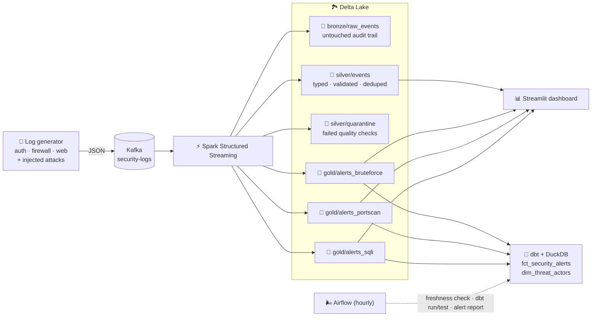

<h1 align="center">🌊 Secure Log Streaming Pipeline</h1>

<p align="center">
  <b>Real-time security analytics lakehouse: Kafka → Spark Structured Streaming → Delta Lake → dbt, orchestrated by Airflow</b>
</p>

<p align="center">
  
  
  
  
  
  
  
  
  
</p>

---

## 🎯 What this does

Security teams drown in logs. This project ingests **auth, firewall and web logs in real time**, organizes them into a **medallion lakehouse** (bronze → silver → gold), and **detects attacks within seconds**:

| Detection | Logic | Severity |
|---|---|---|
| 🔐 **Brute force** | ≥ 10 failed logins from one IP in a 1-minute window | `high`, or `critical` at 3× threshold |
| 📡 **Port scan** | ≥ 20 distinct destination ports from one IP in 1 minute | `medium`, or `high` at 2× threshold |
| 💉 **SQL injection** | Web paths matching injection signatures (`' OR '1'='1`, `UNION SELECT`, `DROP TABLE`, ...) | `high` if the server answered `200`, else `medium` |

Bad records are never silently dropped: they're routed to a **quarantine table** with the exact rejection reason.

## 🏗️ Architecture



## ✨ Engineering highlights

- **Medallion architecture** on Delta Lake: ACID writes, schema enforcement, and time travel over streaming data
- **Exactly-once-style processing** with Kafka offsets + Spark checkpoints, plus **idempotent producer** settings
- **Event-time windowing with watermarks** so late-arriving logs are handled correctly and state stays bounded
- **De-duplication** with `dropDuplicatesWithinWatermark` on `event_id`
- **Data quality gates** that quarantine malformed records (missing IP, unparseable timestamp, unknown source) with a reason code
- **dbt tests** (`unique`, `not_null`, `accepted_values`) on every alert model
- **Airflow DAG** with a freshness SLA check that fails fast if the stream stalls
- **Config-driven thresholds** via environment variables, no code changes needed to tune detections
- **CI** with linting and unit tests for the generator and detection rules

## 🚀 Quick start

**Requirements:** Docker + Docker Compose (about 4 GB RAM free).

```bash
git clone https://github.com/shanmukhasaiteja/secure-log-streaming-pipeline.git
cd secure-log-streaming-pipeline

make up          # Kafka + producer + Spark streaming + dashboard
```

| Service | URL |
|---|---|
| 📊 Dashboard | http://localhost:8501 |
| ⚡ Spark UI | http://localhost:4040 |
| 🌬️ Airflow (optional, `make airflow`) | http://localhost:8080 |

Give it a minute or two for Spark to download its packages and for the first attacks to be injected, then:

```bash
make transform   # build dbt models + run data tests
make airflow     # optional: hourly orchestration (credentials printed in `docker compose logs airflow`)
make test        # unit tests, no Docker needed
make down        # stop everything (make reset also wipes the lake)
```

## 📂 Project structure

```
├── producer/            # Synthetic log generator + Kafka producer
│   ├── log_generator.py #   normal traffic, attack scenarios, malformed records
│   └── producer.py
├── spark/               # Structured Streaming job
│   ├── stream_job.py    #   bronze / silver / quarantine / gold queries
│   └── detections.py    #   thresholds + signatures (shared with tests)
├── dbt/                 # Analytics models on top of the gold layer (dbt-duckdb)
│   └── models/
│       ├── staging/     #   one model per detection table
│       └── marts/       #   fct_security_alerts, agg_alerts_daily, dim_threat_actors
├── airflow/dags/        # Hourly freshness check → dbt run → dbt test → critical alert report
├── dashboard/           # Streamlit app querying Delta tables live via DuckDB
├── tests/               # pytest unit tests
└── docker-compose.yml
```

## ⚙️ Configuration

All settings live in `.env` (created from `.env.example` on first `make up`):

| Variable | Default | Purpose |
|---|---|---|
| `EVENTS_PER_SEC` | `50` | Producer throughput |
| `ATTACK_RATE` | `0.02` | Probability that a batch is an attack burst |
| `BRUTE_FORCE_THRESHOLD` | `10` | Failed logins per IP per minute |
| `PORT_SCAN_THRESHOLD` | `20` | Distinct ports per IP per minute |
| `TRIGGER_INTERVAL` | `10 seconds` | Spark micro-batch interval |

## 🧠 Design decisions

- **Why bronze keeps raw JSON:** if a parsing bug ships, the raw layer lets you replay and rebuild silver/gold without re-reading Kafka.
- **Why quarantine instead of drop:** silently discarding records hides upstream problems; a quarantine table makes data quality measurable.
- **Why detections run on the validated stream (not silver):** it avoids chaining multiple stateful operators, keeping state small and latency low.
- **Why `approx_count_distinct`:** exact distinct counts aren't supported on streaming aggregations, and HyperLogLog is accurate enough for a threshold rule.
- **Why DuckDB for dbt and the dashboard:** it reads Delta tables directly, so analytics needs no separate warehouse to run locally.

## 🗺️ Roadmap

- [ ] Feed silver events into an ML anomaly detector (ml-intrusion-detection, coming next)
- [ ] Enrich IPs with threat-intel reputation feeds
- [ ] Push critical alerts to Slack / PagerDuty
- [ ] Deploy on cloud object storage (S3 + Databricks / EMR)

## 📄 License

MIT © Shanmukh
